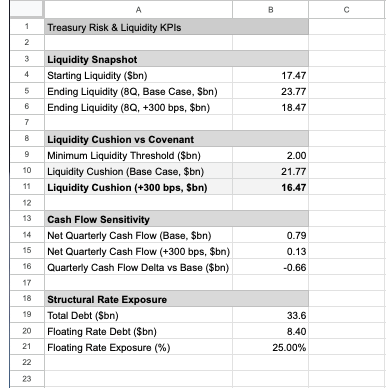
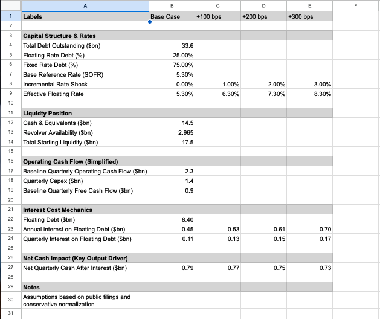

# Liquidity Risk in a Higher-for-Longer Rate Environment  
## A Treasury Decision Framework for United Airlines

**Supporting Model:**  
Liquidity Risk in a Higher-for-Longer Rate Environment Spreadsheet: https://docs.google.com/spreadsheets/d/1MG_1umnTM71S6mpqHAaJkIYeLX4keCICNl4IfOVoda4/edit?usp=sharing

---

## Business Question

How does a structurally higher interest-rate environment quietly erode corporate liquidity and strategic flexibility — even when near-term solvency risk appears low — and how should treasury teams adapt their decision frameworks before stress becomes operationally visible?

This project reframes liquidity risk away from binary outcomes (e.g., covenant breach or insolvency) and toward a more subtle but critical question: how persistent rate pressure constrains capital allocation optionality over time.

---

## Why This Matters

Corporate liquidity is often monitored through a compliance-oriented lens:  
- Absolute cash balances  
- Revolver availability  
- Minimum liquidity thresholds  

While necessary, these metrics are insufficient in a higher-for-longer rate environment. Interest expense and modest demand variability rarely trigger immediate alarms, yet together they materially alter the pace at which liquidity is generated and preserved.

By the time traditional liquidity metrics signal stress, strategic flexibility has often already narrowed — turning proactive balance sheet decisions into reactive trade-offs.

---

## Analytical Framework

The analysis employs a streamlined, decision-focused treasury framework rather than a full financial forecast. The model integrates four core elements:

- **Interest-rate exposure**  
  Identification of floating-rate debt subject to benchmark movements  

- **Quarterly net cash generation**  
  Adjusted for interest expense and modest demand softness  

- **Liquidity runway**  
  Modeled over an eight-quarter horizon  

- **Scenario analysis**  
  Higher-for-longer rate environments rather than transient shocks  

Assumptions are grounded in public disclosures and normalized cash flow metrics, prioritizing interpretability and decision relevance over point precision.

---

## Key Findings

- United maintains ample liquidity across all modeled scenarios, including a +300 bps rate environment combined with mild demand softness  
- Liquidity remains well above minimum covenant thresholds throughout the projection horizon  
- Higher-for-longer rates materially reduce quarterly net cash generation due to increased interest burden and reduced operating leverage  
- Over an eight-quarter horizon, liquidity accumulation is reduced by more than $5 billion relative to the base case  

The risk is not liquidity insufficiency, but the quiet erosion of optionality — flexibility that would otherwise support investment, deleveraging, or strategic buffering.

---

## Strategic Implications

Liquidity serves not only as a downside buffer, but as a source of strategic leverage in capital-intensive, cyclical businesses. Incremental interest-rate pressure introduces subtle trade-offs:

- Delayed investment  
- Persistent leverage  
- Narrowed response capacity during volatility  

These effects accumulate gradually and are often missed by static liquidity reporting.

---

## Repository Contents (At a Glance)

- `assets/` — Executive-level screenshots illustrating liquidity runway, KPI dashboard, and key assumptions  
- `memo/` — Executive summary and treasury decision narrative  
- `README.md` — Project overview, analytical framework, and decision implications  

---

## Appendix: Model Screenshots (Executive Review Views)

**KPI Dashboard**  

**Liquidity Runway**  
)

**Key Assumptions**  

